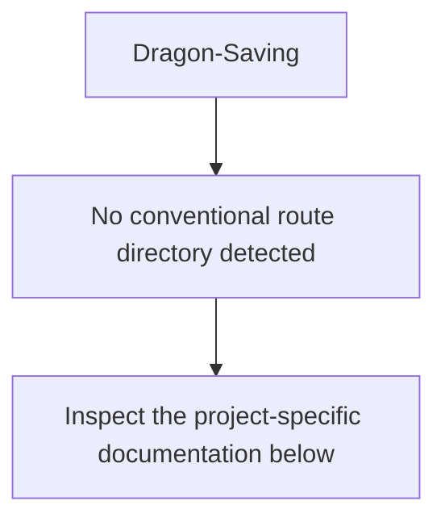
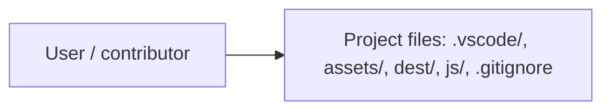
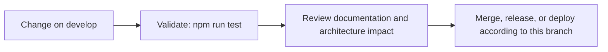

# sassBoilerplate

<!-- interactive-readme-standard:start -->

> [!NOTE]
> **Branch-specific documentation:** this section is maintained for [`develop`](https://github.com/Nischhalsubba/Dragon-Saving/tree/develop). It is generated from the files present on this branch and preserves the project-authored README below.

<strong>Interactive repository guide</strong>

## Branch overview

| Item | Value |
|---|---|
| Repository | [`Nischhalsubba/Dragon-Saving`](https://github.com/Nischhalsubba/Dragon-Saving) |
| Branch | [`develop`](https://github.com/Nischhalsubba/Dragon-Saving/tree/develop) |
| Detected stack | Sass, JavaScript, HTML, CSS |
| Detected manifests | package.json |
| Documentation policy | Every maintained branch must explain purpose, setup, structure, architecture, flows, testing, delivery, security, and ownership. |

## Repository structure

The diagram is generated from the branch's actual top-level files and directories. Use the branch link above for complete source navigation.

## Website or application structure

## Application and responsibility flow

## Change-to-delivery flow

## README requirements for this branch

- Explain what this branch contains and how it differs from the default branch.
- Keep installation, configuration, usage, testing, deployment, security, support, and license information accurate.
- Document repository, website or application, API, data, authentication, background-job, and deployment flows when they exist.
- Prefer Mermaid diagrams and expandable `
` sections for visual navigation.
- Link diagrams and modules to real source paths; never invent missing components.
- Preserve project-specific documentation and update diagrams whenever architecture or major paths change.
- Treat secrets, private infrastructure, customer data, and credentials as prohibited README content.

<!-- interactive-readme-standard:end -->

**Front-end Boilerplate using Sass and Gulp 4**

Using a set of boilerplate files when you're starting a website project can be a huge time-saver. Instead of having to start from scratch or copy and paste from previous projects, you can get up and running in just a minute or two.

I wanted to share my own boilerplate that I use for simple front-end websites that use HTML, SCSS, and JavaScript. And I'm using Gulp 4 to compile, prefix, and minify my files.

**Quickstart guide**

    - Clone or download this Git repo onto your computer.
    - Install Node.js if you don't have it yet.
    - Run npm install
    - Run gulp to run the default Gulp task

**In this proejct, Gulp is configured to run the following functions:**

   - Compile the SCSS files to CSS
   - Autoprefix and minify the CSS file
   - Concatenate the JS files
   - Uglify the JS files
   - Move final CSS and JS files to the /dist folder
   
   
   
**Demo Here**
    - https://nischhalsubba.github.io/sassUtilities/
