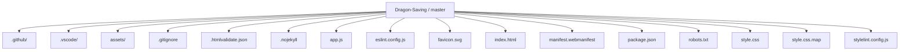
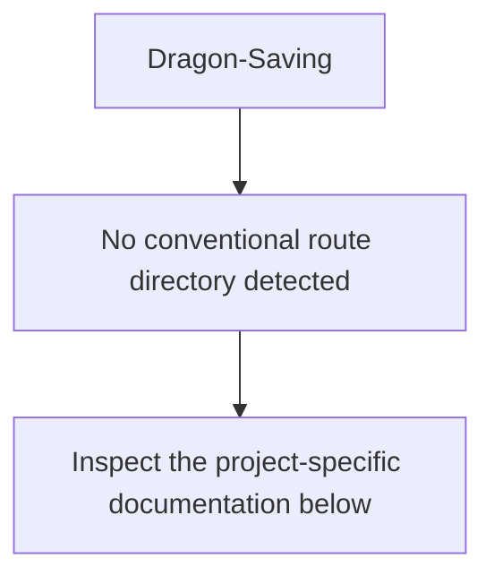
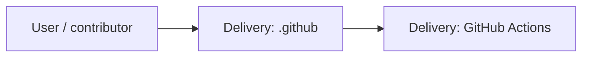
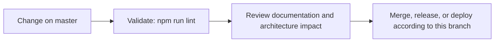

# Dragon Savings Website Redesign

<!-- interactive-readme-standard:start -->

> [!NOTE]
> **Branch-specific documentation:** this section is maintained for [`master`](https://github.com/Nischhalsubba/Dragon-Saving/tree/master). It is generated from the files present on this branch and preserves the project-authored README below.

<details open>
<summary><strong>Interactive repository guide</strong></summary>

## Branch overview

| Item | Value |
|---|---|
| Repository | [`Nischhalsubba/Dragon-Saving`](https://github.com/Nischhalsubba/Dragon-Saving) |
| Branch | [`master`](https://github.com/Nischhalsubba/Dragon-Saving/tree/master) |
| Detected stack | Sass, JavaScript, HTML, CSS |
| Detected manifests | package.json |
| Documentation policy | Every maintained branch must explain purpose, setup, structure, architecture, flows, testing, delivery, security, and ownership. |

## Repository structure



The diagram is generated from the branch's actual top-level files and directories. Use the branch link above for complete source navigation.

## Website or application structure



## Application and responsibility flow



## Change-to-delivery flow



## README requirements for this branch

- Explain what this branch contains and how it differs from the default branch.
- Keep installation, configuration, usage, testing, deployment, security, support, and license information accurate.
- Document repository, website or application, API, data, authentication, background-job, and deployment flows when they exist.
- Prefer Mermaid diagrams and expandable `<details>` sections for visual navigation.
- Link diagrams and modules to real source paths; never invent missing components.
- Preserve project-specific documentation and update diagrams whenever architecture or major paths change.
- Treat secrets, private infrastructure, customer data, and credentials as prohibited README content.

</details>

<!-- interactive-readme-standard:end -->

A modern, accessible static website for **Dragon Savings and Credit Cooperative Limited**, based on the organisation's public website content and official logo.

## Design goal

The site is designed for first-time visitors who may not be financially educated. Instead of beginning with product terminology, it starts with three simple needs:

1. I want to save.
2. I need a loan.
3. I want to send or receive money.

The interface then explains relevant services in plain language, includes Nepali support labels for key choices, and repeatedly directs visitors to confirm current rates, eligibility, documents and terms with the cooperative.

## Included

- Official Dragon Savings logo
- Responsive, mobile-first layout
- Plain-language service navigator
- Savings, loan, remittance and digital-service categories
- English content with selective Nepali support labels
- Cooperative history and registration information
- Chairman's message
- Contact details and social links
- Keyboard-accessible tabs and navigation
- Reduced-motion support and visible focus states
- Mobile quick-action bar for calling, services and directions

## Content source

Public organisation details, service names, contact information and the logo were adapted from:

https://dragonsaving.com.np/

The redesign does not publish interest rates or promise eligibility because those details may change. Visitors are advised to confirm current terms directly with the cooperative.

## Run locally

No build step is required.

```bash
python -m http.server 8000
```

Open:

```text
http://127.0.0.1:8000/
```

## Files

| File | Purpose |
|---|---|
| `index.html` | Page structure, content and accessible navigation |
| `style.css` | Brand system, layouts, components and responsive states |
| `app.js` | Service navigator, need selector, mobile menu and reveal states |
| `manifest.webmanifest` | Basic site metadata |
| `.nojekyll` | Static GitHub Pages configuration |
