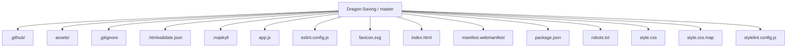
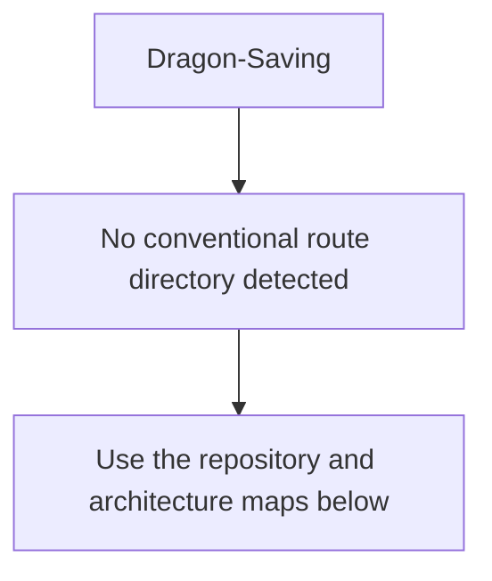
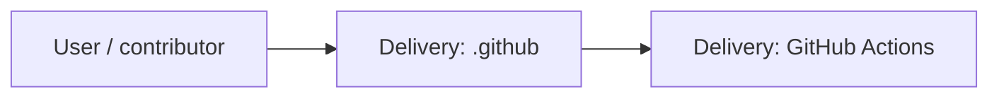
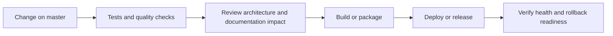
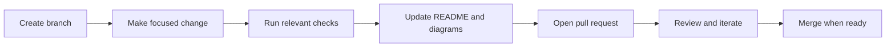

<!-- interactive-readme-standard:start -->

<div align="center">

# Dragon-Saving

**Branch-aware technical guide for [`master`](https://github.com/Nischhalsubba/Dragon-Saving/tree/master)**

<p>     </p>

<p>
  <a href="https://github.com/Nischhalsubba/Dragon-Saving/tree/master"><strong>Browse source</strong></a> ·
  <a href="https://github.com/Nischhalsubba/Dragon-Saving/issues"><strong>Issues</strong></a> ·
  <a href="https://github.com/Nischhalsubba/Dragon-Saving/codespaces/new?ref=master"><strong>Open in Codespaces</strong></a>
</p>

</div>

> [!IMPORTANT]
> This guide is generated from the files actually present on `master`. It links to detected source paths, preserves project-authored notes, and avoids claiming components that were not found.

## At a glance

| Item | Detected value |
|---|---|
| Purpose | Static redesign for Dragon Savings and Credit Cooperative Limited. |
| Branch role | Default branch |
| Stack | Sass, JavaScript, HTML, CSS |
| Manifests | package.json |
| Prerequisites | Node.js |
| Delivery | GitHub Actions |
| License | No license file detected |

## Branch scope

This is the repository's default branch.


## Quick start

```bash
npm install
npm run lint
```

### Configuration surface

- No committed environment example file was detected.

> Never commit secrets, private keys, production credentials, customer data, or unredacted infrastructure details.

## Repository map



| Responsibility | Detected source paths |
|---|---|
| Delivery | [`.github`](https://github.com/Nischhalsubba/Dragon-Saving/tree/master/.github) |

## Website or application map



## Architecture and responsibility flow




## Quality, security, and operations

<table>
<tr>
<td width="33%" valign="top">

### Quality

- No conventional test directory was detected automatically.

Detected commands:
- `npm run lint`

</td>
<td width="33%" valign="top">

### Security

- No dedicated security policy or automated dependency configuration was detected.

Review authentication, authorization, input validation, dependency updates, secret handling, and failure recovery before release.

</td>
<td width="34%" valign="top">

### Observability

- No dedicated observability integration was detected automatically.

Define useful logs, metrics, traces, alerts, and rollback signals for production-facing branches.

</td>
</tr>
</table>

## Delivery flow



### Automation detected

- [`.github/workflows/apply-interactive-readme.yml`](https://github.com/Nischhalsubba/Dragon-Saving/blob/master/.github/workflows/apply-interactive-readme.yml)
- [`.github/workflows/quality.yml`](https://github.com/Nischhalsubba/Dragon-Saving/blob/master/.github/workflows/quality.yml)

## Contribution flow



- Keep changes focused and explain architectural consequences.
- Run the checks relevant to the changed area.
- Update diagrams whenever routes, modules, data models, authentication, jobs, or delivery paths change.
- Add screenshots or recordings for visual behavior changes when useful.
- Use issues for reproducible defects and pull requests for reviewable changes.

## Ownership and support

| Topic | Source |
|---|---|
| Repository | [`Nischhalsubba/Dragon-Saving`](https://github.com/Nischhalsubba/Dragon-Saving) |
| Branch | [`master`](https://github.com/Nischhalsubba/Dragon-Saving/tree/master) |
| Ownership | No CODEOWNERS file detected |
| Contributing | Use the contribution flow above |
| Support | [Open or review issues](https://github.com/Nischhalsubba/Dragon-Saving/issues) |
| License | No license file detected |

<details>
<summary><strong>Documentation maintenance checklist</strong></summary>

- [ ] Purpose and branch scope are accurate.
- [ ] Setup and configuration commands still work.
- [ ] Repository, application, API, data, authentication, job, and deployment diagrams match the code.
- [ ] Tests, security controls, observability, and rollback behavior are documented.
- [ ] Links point to real files on this branch.
- [ ] No secrets or private operational details are exposed.

</details>

<!-- interactive-readme-standard:end -->

<!-- project-authored-notes:start -->
<details>
<summary><strong>Project-authored notes preserved from this branch</strong></summary>

# Dragon Savings Website Redesign

A modern, accessible static website for **Dragon Savings and Credit Cooperative Limited**, based on the organisation's public website content and official logo.

## Design goal

The site is designed for first-time visitors who may not be financially educated. Instead of beginning with product terminology, it starts with three simple needs:

1. I want to save.
2. I need a loan.
3. I want to send or receive money.

The interface then explains relevant services in plain language, includes Nepali support labels for key choices, and repeatedly directs visitors to confirm current rates, eligibility, documents and terms with the cooperative.

## Included

- Official Dragon Savings logo
- Responsive, mobile-first layout
- Plain-language service navigator
- Savings, loan, remittance and digital-service categories
- English content with selective Nepali support labels
- Cooperative history and registration information
- Chairman's message
- Contact details and social links
- Keyboard-accessible tabs and navigation
- Reduced-motion support and visible focus states
- Mobile quick-action bar for calling, services and directions

## Content source

Public organisation details, service names, contact information and the logo were adapted from:

https://dragonsaving.com.np/

The redesign does not publish interest rates or promise eligibility because those details may change. Visitors are advised to confirm current terms directly with the cooperative.

## Run locally

No build step is required.

```bash
python -m http.server 8000
```

Open:

```text
http://127.0.0.1:8000/
```

## Files

| File | Purpose |
|---|---|
| `index.html` | Page structure, content and accessible navigation |
| `style.css` | Brand system, layouts, components and responsive states |
| `app.js` | Service navigator, need selector, mobile menu and reveal states |
| `manifest.webmanifest` | Basic site metadata |
| `.nojekyll` | Static GitHub Pages configuration |

</details>
<!-- project-authored-notes:end -->
