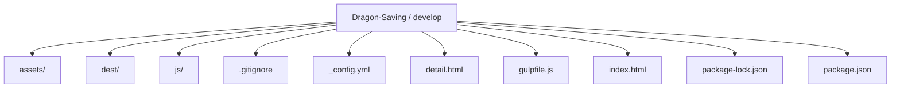
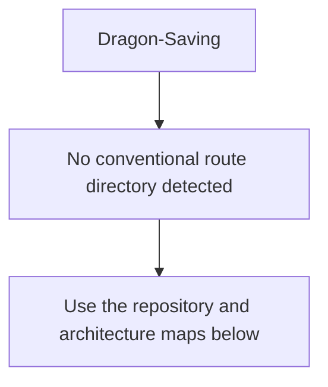
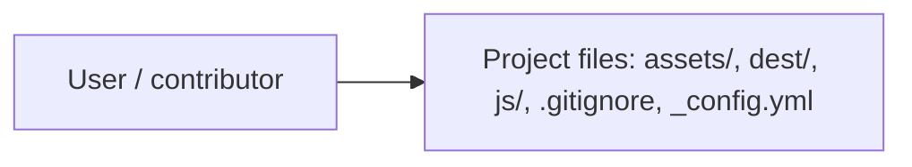
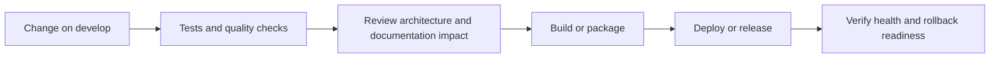
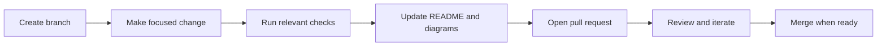

<!-- interactive-readme-standard:start -->

<div align="center">

# Dragon-Saving

**Branch-aware technical guide for [`develop`](https://github.com/Nischhalsubba/Dragon-Saving/tree/develop)**

<p>     </p>

<p>
  <a href="https://github.com/Nischhalsubba/Dragon-Saving/tree/develop"><strong>Browse source</strong></a> ·
  <a href="https://github.com/Nischhalsubba/Dragon-Saving/issues"><strong>Issues</strong></a> ·
  <a href="https://github.com/Nischhalsubba/Dragon-Saving/codespaces/new?ref=develop"><strong>Open in Codespaces</strong></a>
</p>

</div>

> [!IMPORTANT]
> This guide is generated from the files actually present on `develop`. It links to detected source paths, preserves project-authored notes, and avoids claiming components that were not found.

## At a glance

| Item | Detected value |
|---|---|
| Purpose | **Front-end Boilerplate using Sass and Gulp 4** |
| Branch role | Compared with `master` |
| Stack | Sass, JavaScript, HTML, CSS |
| Manifests | package.json |
| Prerequisites | Node.js |
| Delivery | No conventional deployment configuration detected |
| License | No license file detected |

## Branch scope

This branch differs from the default branch in the following detected paths:

- [`README.md`](https://github.com/Nischhalsubba/Dragon-Saving/blob/develop/README.md)
- [`assets/Images/Weiss Logo.png`](https://github.com/Nischhalsubba/Dragon-Saving/blob/develop/assets/Images/Weiss%20Logo.png)
- [`assets/js/index.js`](https://github.com/Nischhalsubba/Dragon-Saving/blob/develop/assets/js/index.js)
- [`assets/sass/base/_base.scss`](https://github.com/Nischhalsubba/Dragon-Saving/blob/develop/assets/sass/base/_base.scss)
- [`assets/sass/base/_typography.scss`](https://github.com/Nischhalsubba/Dragon-Saving/blob/develop/assets/sass/base/_typography.scss)
- [`assets/sass/helper/_buttons.scss`](https://github.com/Nischhalsubba/Dragon-Saving/blob/develop/assets/sass/helper/_buttons.scss)
- [`assets/sass/helper/_varaibles.scss`](https://github.com/Nischhalsubba/Dragon-Saving/blob/develop/assets/sass/helper/_varaibles.scss)
- [`assets/sass/layout/_footer.scss`](https://github.com/Nischhalsubba/Dragon-Saving/blob/develop/assets/sass/layout/_footer.scss)
- [`assets/sass/layout/_header.scss`](https://github.com/Nischhalsubba/Dragon-Saving/blob/develop/assets/sass/layout/_header.scss)
- [`assets/sass/layout/_navigation.scss`](https://github.com/Nischhalsubba/Dragon-Saving/blob/develop/assets/sass/layout/_navigation.scss)
- [`assets/sass/pages/_blog.scss`](https://github.com/Nischhalsubba/Dragon-Saving/blob/develop/assets/sass/pages/_blog.scss)
- [`assets/sass/pages/_home.scss`](https://github.com/Nischhalsubba/Dragon-Saving/blob/develop/assets/sass/pages/_home.scss)

## Quick start

```bash
npm install
npm run test
```

### Configuration surface

- No committed environment example file was detected.

> Never commit secrets, private keys, production credentials, customer data, or unredacted infrastructure details.

## Repository map



| Responsibility | Detected source paths |
|---|---|
| Project files | [`assets/`](https://github.com/Nischhalsubba/Dragon-Saving/tree/develop/assets/), [`dest/`](https://github.com/Nischhalsubba/Dragon-Saving/tree/develop/dest/), [`js/`](https://github.com/Nischhalsubba/Dragon-Saving/tree/develop/js/), [`.gitignore`](https://github.com/Nischhalsubba/Dragon-Saving/blob/develop/.gitignore), [`_config.yml`](https://github.com/Nischhalsubba/Dragon-Saving/blob/develop/_config.yml) |

## Website or application map



## Architecture and responsibility flow




## Quality, security, and operations

<table>
<tr>
<td width="33%" valign="top">

### Quality

- No conventional test directory was detected automatically.

Detected commands:
- `npm run test`

</td>
<td width="33%" valign="top">

### Security

- No dedicated security policy or automated dependency configuration was detected.

Review authentication, authorization, input validation, dependency updates, secret handling, and failure recovery before release.

</td>
<td width="34%" valign="top">

### Observability

- No dedicated observability integration was detected automatically.

Define useful logs, metrics, traces, alerts, and rollback signals for production-facing branches.

</td>
</tr>
</table>

## Delivery flow



### Automation detected

- No GitHub Actions workflow files were detected.

## Contribution flow



- Keep changes focused and explain architectural consequences.
- Run the checks relevant to the changed area.
- Update diagrams whenever routes, modules, data models, authentication, jobs, or delivery paths change.
- Add screenshots or recordings for visual behavior changes when useful.
- Use issues for reproducible defects and pull requests for reviewable changes.

## Ownership and support

| Topic | Source |
|---|---|
| Repository | [`Nischhalsubba/Dragon-Saving`](https://github.com/Nischhalsubba/Dragon-Saving) |
| Branch | [`develop`](https://github.com/Nischhalsubba/Dragon-Saving/tree/develop) |
| Ownership | No CODEOWNERS file detected |
| Contributing | Use the contribution flow above |
| Support | [Open or review issues](https://github.com/Nischhalsubba/Dragon-Saving/issues) |
| License | No license file detected |

<details>
<summary><strong>Documentation maintenance checklist</strong></summary>

- [ ] Purpose and branch scope are accurate.
- [ ] Setup and configuration commands still work.
- [ ] Repository, application, API, data, authentication, job, and deployment diagrams match the code.
- [ ] Tests, security controls, observability, and rollback behavior are documented.
- [ ] Links point to real files on this branch.
- [ ] No secrets or private operational details are exposed.

</details>

<!-- interactive-readme-standard:end -->

<!-- project-authored-notes:start -->
<details>
<summary><strong>Project-authored notes preserved from this branch</strong></summary>

# sassBoilerplate

**Front-end Boilerplate using Sass and Gulp 4**

Using a set of boilerplate files when you're starting a website project can be a huge time-saver. Instead of having to start from scratch or copy and paste from previous projects, you can get up and running in just a minute or two.

I wanted to share my own boilerplate that I use for simple front-end websites that use HTML, SCSS, and JavaScript. And I'm using Gulp 4 to compile, prefix, and minify my files.

**Quickstart guide**

    - Clone or download this Git repo onto your computer.
    - Install Node.js if you don't have it yet.
    - Run npm install
    - Run gulp to run the default Gulp task

**In this proejct, Gulp is configured to run the following functions:**

   - Compile the SCSS files to CSS
   - Autoprefix and minify the CSS file
   - Concatenate the JS files
   - Uglify the JS files
   - Move final CSS and JS files to the /dist folder
   
   
   
**Demo Here**
    - https://nischhalsubba.github.io/sassUtilities/

</details>
<!-- project-authored-notes:end -->
