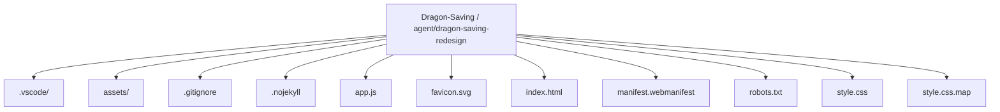
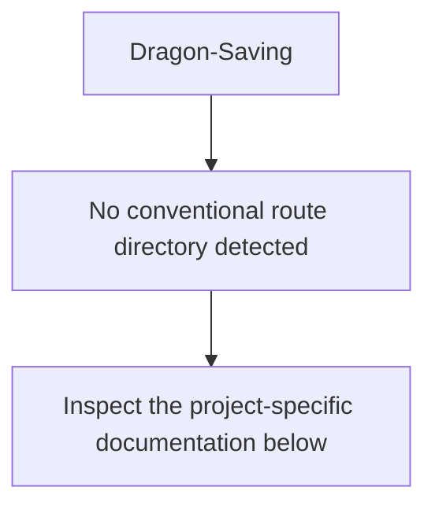
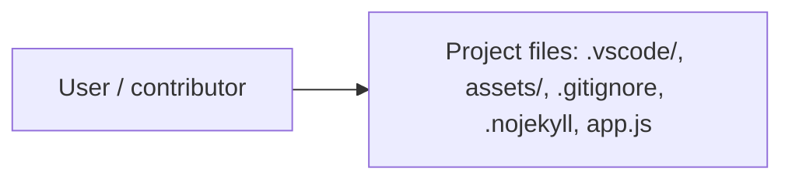
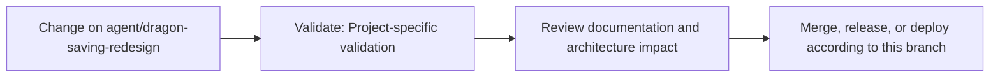

# Dragon Saving

<!-- interactive-readme-standard:start -->

> [!NOTE]
> **Branch-specific documentation:** this section is maintained for [`agent/dragon-saving-redesign`](https://github.com/Nischhalsubba/Dragon-Saving/tree/agent/dragon-saving-redesign). It is generated from the files present on this branch and preserves the project-authored README below.

<details open>
<summary><strong>Interactive repository guide</strong></summary>

## Branch overview

| Item | Value |
|---|---|
| Repository | [`Nischhalsubba/Dragon-Saving`](https://github.com/Nischhalsubba/Dragon-Saving) |
| Branch | [`agent/dragon-saving-redesign`](https://github.com/Nischhalsubba/Dragon-Saving/tree/agent/dragon-saving-redesign) |
| Detected stack | Sass, JavaScript, HTML, CSS |
| Detected manifests | No standard manifest detected |
| Documentation policy | Every maintained branch must explain purpose, setup, structure, architecture, flows, testing, delivery, security, and ownership. |

## Repository structure



The diagram is generated from the branch's actual top-level files and directories. Use the branch link above for complete source navigation.

## Website or application structure



## Application and responsibility flow



## Change-to-delivery flow



## README requirements for this branch

- Explain what this branch contains and how it differs from the default branch.
- Keep installation, configuration, usage, testing, deployment, security, support, and license information accurate.
- Document repository, website or application, API, data, authentication, background-job, and deployment flows when they exist.
- Prefer Mermaid diagrams and expandable `<details>` sections for visual navigation.
- Link diagrams and modules to real source paths; never invent missing components.
- Preserve project-specific documentation and update diagrams whenever architecture or major paths change.
- Treat secrets, private infrastructure, customer data, and credentials as prohibited README content.

</details>

<!-- interactive-readme-standard:end -->

Dragon Saving is a modern, gamified savings-tracker concept that turns a simple financial goal into a dragon you can raise through visible progress and clear milestones.

## What is included

- Responsive single-page product experience
- Interactive savings goal editor
- Browser-local persistence with `localStorage`
- Five progress stages: Dragon Egg, Hatchling, Young Dragon, Guardian, and Legendary
- Accessible native dialogs and forms
- Mobile navigation, reduced-motion support, visible focus states, and semantic HTML
- No build step, framework, backend, account system, or banking integration

## Product principles

1. Set a savings goal.
2. Add savings progress.
3. Reach a visible milestone.
4. Unlock or grow a virtual dragon reward.
5. Keep the interface playful without hiding important financial information.

## Privacy and safety

This repository is a frontend prototype, not a bank or financial service.

- Data is stored only in the current browser using `localStorage`.
- No bank account is connected.
- No real money is moved or stored.
- No authentication or cloud synchronization is implemented.
- Clearing browser data removes the saved goal.
- The experience does not provide financial advice.

Do not add real financial credentials, secrets, account numbers, or sensitive personal data to this project.

## Run locally

No installation or build command is required.

```bash
python -m http.server 8000
```

Then open:

```text
http://127.0.0.1:8000/
```

## Files

| File | Purpose |
|---|---|
| `index.html` | Semantic page structure, product content, inline SVG artwork, and dialogs |
| `style.css` | Design system, responsive layout, illustrations, animation, and accessibility states |
| `app.js` | Goal state, validation, local persistence, milestone logic, and interactions |
| `favicon.svg` | Project icon |
| `manifest.webmanifest` | Basic installable-site metadata |
| `.nojekyll` | Keeps GitHub Pages in static-file mode |

## Deployment

The default branch is served with GitHub Pages at:

https://nischhalsubba.github.io/Dragon-Saving/

## Future directions

A secure future product could add optional authenticated sync, multiple goals, contribution history, reminders, and a collectible dragon library. Those features are intentionally not claimed in this prototype.
