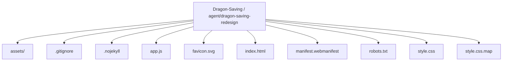
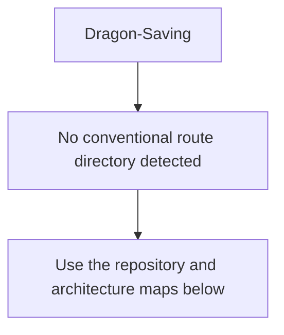
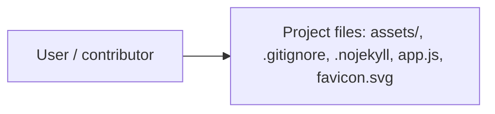
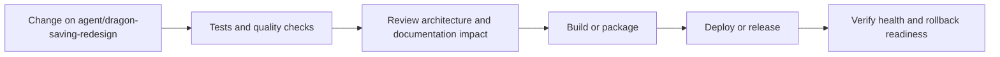
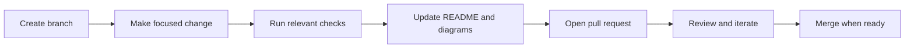

<!-- interactive-readme-standard:start -->

<div align="center">

# Dragon-Saving

**Branch-aware technical guide for [`agent/dragon-saving-redesign`](https://github.com/Nischhalsubba/Dragon-Saving/tree/agent/dragon-saving-redesign)**

<p>     </p>

<p>
  <a href="https://github.com/Nischhalsubba/Dragon-Saving/tree/agent/dragon-saving-redesign"><strong>Browse source</strong></a> ·
  <a href="https://github.com/Nischhalsubba/Dragon-Saving/issues"><strong>Issues</strong></a> ·
  <a href="https://github.com/Nischhalsubba/Dragon-Saving/codespaces/new?ref=agent%2Fdragon-saving-redesign"><strong>Open in Codespaces</strong></a>
</p>

</div>

> [!IMPORTANT]
> This guide is generated from the files actually present on `agent/dragon-saving-redesign`. It links to detected source paths, preserves project-authored notes, and avoids claiming components that were not found.

## At a glance

| Item | Detected value |
|---|---|
| Purpose | A Sass project documented from the current branch structure and manifests. |
| Branch role | Compared with `master` |
| Stack | Sass, JavaScript, HTML, CSS |
| Manifests | No standard manifest detected |
| Prerequisites | Confirm from the detected manifests |
| Delivery | No conventional deployment configuration detected |
| License | No license file detected |

## Branch scope

This branch differs from the default branch in the following detected paths:

- [`README.md`](https://github.com/Nischhalsubba/Dragon-Saving/blob/agent/dragon-saving-redesign/README.md)

## Quick start

> No reliable setup command was detected. Use the preserved project-authored notes and manifests rather than guessing.

### Configuration surface

- No committed environment example file was detected.

> Never commit secrets, private keys, production credentials, customer data, or unredacted infrastructure details.

## Repository map



| Responsibility | Detected source paths |
|---|---|
| Project files | [`assets/`](https://github.com/Nischhalsubba/Dragon-Saving/tree/agent/dragon-saving-redesign/assets/), [`.gitignore`](https://github.com/Nischhalsubba/Dragon-Saving/blob/agent/dragon-saving-redesign/.gitignore), [`.nojekyll`](https://github.com/Nischhalsubba/Dragon-Saving/blob/agent/dragon-saving-redesign/.nojekyll), [`app.js`](https://github.com/Nischhalsubba/Dragon-Saving/blob/agent/dragon-saving-redesign/app.js), [`favicon.svg`](https://github.com/Nischhalsubba/Dragon-Saving/blob/agent/dragon-saving-redesign/favicon.svg) |

## Website or application map



## Architecture and responsibility flow




## Quality, security, and operations

<table>
<tr>
<td width="33%" valign="top">

### Quality

- No conventional test directory was detected automatically.

Detected commands:
- No standard quality command detected.

</td>
<td width="33%" valign="top">

### Security

- No dedicated security policy or automated dependency configuration was detected.

Review authentication, authorization, input validation, dependency updates, secret handling, and failure recovery before release.

</td>
<td width="34%" valign="top">

### Observability

- No dedicated observability integration was detected automatically.

Define useful logs, metrics, traces, alerts, and rollback signals for production-facing branches.

</td>
</tr>
</table>

## Delivery flow



### Automation detected

- No GitHub Actions workflow files were detected.

## Contribution flow



- Keep changes focused and explain architectural consequences.
- Run the checks relevant to the changed area.
- Update diagrams whenever routes, modules, data models, authentication, jobs, or delivery paths change.
- Add screenshots or recordings for visual behavior changes when useful.
- Use issues for reproducible defects and pull requests for reviewable changes.

## Ownership and support

| Topic | Source |
|---|---|
| Repository | [`Nischhalsubba/Dragon-Saving`](https://github.com/Nischhalsubba/Dragon-Saving) |
| Branch | [`agent/dragon-saving-redesign`](https://github.com/Nischhalsubba/Dragon-Saving/tree/agent/dragon-saving-redesign) |
| Ownership | No CODEOWNERS file detected |
| Contributing | Use the contribution flow above |
| Support | [Open or review issues](https://github.com/Nischhalsubba/Dragon-Saving/issues) |
| License | No license file detected |

<details>
<summary><strong>Documentation maintenance checklist</strong></summary>

- [ ] Purpose and branch scope are accurate.
- [ ] Setup and configuration commands still work.
- [ ] Repository, application, API, data, authentication, job, and deployment diagrams match the code.
- [ ] Tests, security controls, observability, and rollback behavior are documented.
- [ ] Links point to real files on this branch.
- [ ] No secrets or private operational details are exposed.

</details>

<!-- interactive-readme-standard:end -->

<!-- project-authored-notes:start -->
<details>
<summary><strong>Project-authored notes preserved from this branch</strong></summary>

# Dragon Saving

Dragon Saving is a modern, gamified savings-tracker concept that turns a simple financial goal into a dragon you can raise through visible progress and clear milestones.

## What is included

- Responsive single-page product experience
- Interactive savings goal editor
- Browser-local persistence with `localStorage`
- Five progress stages: Dragon Egg, Hatchling, Young Dragon, Guardian, and Legendary
- Accessible native dialogs and forms
- Mobile navigation, reduced-motion support, visible focus states, and semantic HTML
- No build step, framework, backend, account system, or banking integration

## Product principles

1. Set a savings goal.
2. Add savings progress.
3. Reach a visible milestone.
4. Unlock or grow a virtual dragon reward.
5. Keep the interface playful without hiding important financial information.

## Privacy and safety

This repository is a frontend prototype, not a bank or financial service.

- Data is stored only in the current browser using `localStorage`.
- No bank account is connected.
- No real money is moved or stored.
- No authentication or cloud synchronization is implemented.
- Clearing browser data removes the saved goal.
- The experience does not provide financial advice.

Do not add real financial credentials, secrets, account numbers, or sensitive personal data to this project.

## Run locally

No installation or build command is required.

```bash
python -m http.server 8000
```

Then open:

```text
http://127.0.0.1:8000/
```

## Files

| File | Purpose |
|---|---|
| `index.html` | Semantic page structure, product content, inline SVG artwork, and dialogs |
| `style.css` | Design system, responsive layout, illustrations, animation, and accessibility states |
| `app.js` | Goal state, validation, local persistence, milestone logic, and interactions |
| `favicon.svg` | Project icon |
| `manifest.webmanifest` | Basic installable-site metadata |
| `.nojekyll` | Keeps GitHub Pages in static-file mode |

## Deployment

The default branch is served with GitHub Pages at:

https://nischhalsubba.github.io/Dragon-Saving/

## Future directions

A secure future product could add optional authenticated sync, multiple goals, contribution history, reminders, and a collectible dragon library. Those features are intentionally not claimed in this prototype.

</details>
<!-- project-authored-notes:end -->
