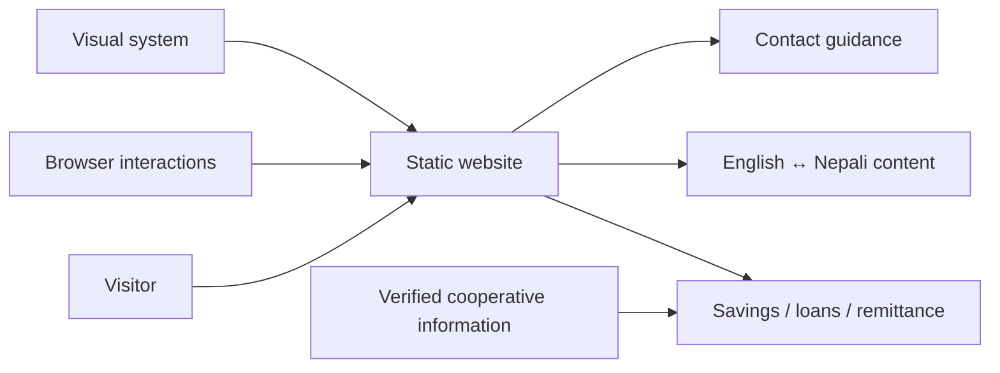
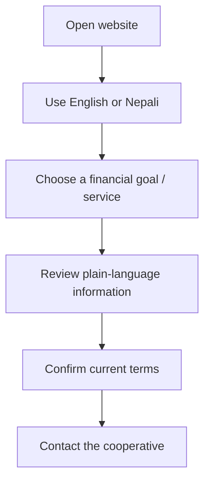
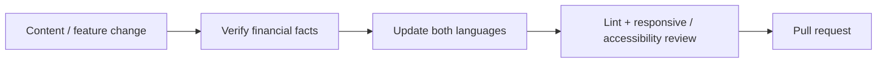

<div align="center">

# Dragon Savings

**A bilingual English/Nepali website for Dragon Savings and Credit Cooperative Limited, focused on clear savings, loan, remittance, and contact guidance.**


[Browse website](./site) · [Technical README](./site/README.md) · [Issues](https://github.com/Nischhalsubba/Dragon-Saving/issues)

</div>

## Overview

**Dragon Savings** is a static bilingual website designed around plain-language customer guidance. Visitors can start from a financial goal, review available service information, switch between English and Nepali, and contact the cooperative for current terms.

| Audience | Focus |
|---|---|
| Customers | Understand services and find a contact path |
| Developers | Maintain semantic HTML, CSS, browser JavaScript and translations |
| Designers | Keep financial information readable, trustworthy and mobile-friendly |
| Content owners | Verify rates, eligibility, documents and service terms before publishing |

<details open>
<summary><strong>🏗️ Interactive website architecture</strong></summary>



</details>

## Customer flow



## Getting started

```bash
git clone https://github.com/Nischhalsubba/Dragon-Saving.git
cd Dragon-Saving/site
npm install
npm run lint
```

The maintained site is dependency-light at runtime. See [`site/README.md`](./site/README.md) for structure, translation behavior, and maintenance details.

## Design, accessibility & trust

Financial content should be scannable and conservative. Preserve semantic structure, keyboard behavior, visible focus, sufficient contrast, mobile navigation, accessible accordions, consistent bilingual labels, and clear separation between general guidance and terms that customers must confirm.

## SEO & local discoverability

Public metadata should accurately use terms such as **Dragon Savings and Credit Cooperative, savings cooperative, savings services, loan information, remittance services, Nepal cooperative, English and Nepali financial information** only when supported by the page. Keep organization details, titles, descriptions, headings, contact data and structured metadata accurate.

## Contribution flow


